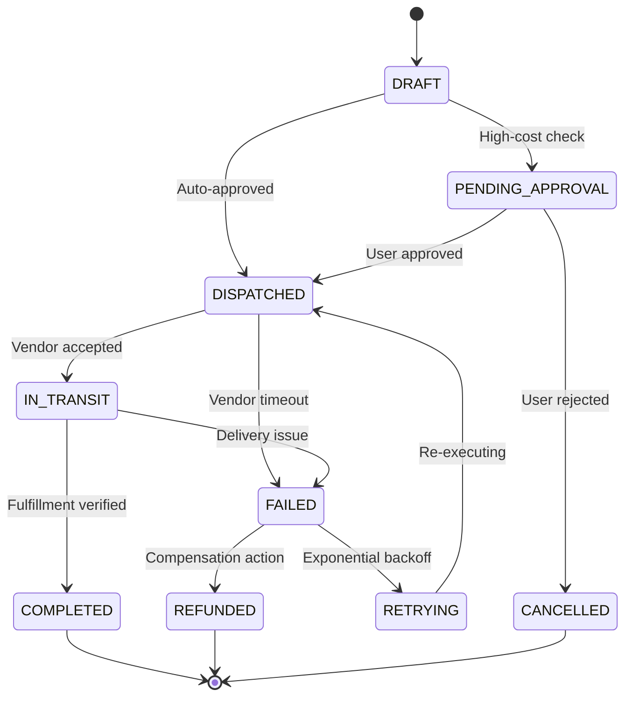

# genpark-autonomous-errand-action-dispatcher-skill

> Autonomous Life-Admin Errand Action Dispatcher with Deterministic FSM. 100% Python Standard Library.

Distilled from errand-execution agents like **Instinct** and **Asaply**, this skill provides an unshakeable finite-state-machine engine to govern physical and digital life administration errands (ordering food, booking rides, cancelling recurring subscriptions).

## State Machine

## Features
- **Deterministic FSM Engine**: Prevents illegal state jumps or double-charges.
- **Complete Audit Trail**: Every status change records timestamp and reason.
- **Failover & Compensation**: Native hooks for automatic retry and refund transitions.
